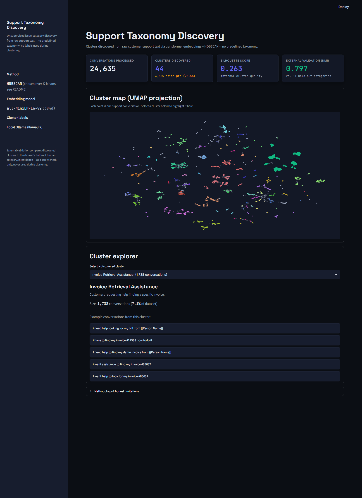

# support-taxonomy-discovery

Unsupervised discovery of natural issue-categories in customer-support
conversations -- no predefined taxonomy, no labels used during discovery.
Transformer embeddings + clustering (K-Means and HDBSCAN) + statistical
validation + LLM-generated cluster summaries via a local Ollama model.

## Why unsupervised discovery?

Support taxonomies are usually hand-defined by whoever set up the helpdesk,
and they drift out of date as products and customer language change. This
project asks a different question: if you throw out the existing labels
entirely and only look at the raw text of what customers actually wrote,
what categories does the data itself suggest? The dataset used here
(Bitext's customer-support dataset) happens to ship with human-defined
`category` / `intent` labels. Those labels are held out completely during
embedding and clustering, and are only brought back at the very end as an
external sanity check on whether the discovered structure resembles
something a human taxonomy would recognize -- not as a target to fit.

## Architecture

```
data_loader.py   -> download + clean the Bitext dataset, split out held-out labels
embeddings.py    -> sentence-transformer embeddings (all-MiniLM-L6-v2), cached to disk
clustering.py    -> K-Means (silhouette-selected k) and HDBSCAN, run and compared
tune_hdbscan.py  -> parameter sweep documenting how the HDBSCAN config was chosen
validation.py    -> silhouette score + ARI/NMI against held-out labels (honest, not optimized for)
visualize.py     -> UMAP projection to 2D for plotting
label_clusters.py -> local Ollama model summarizes each cluster from representative examples
dashboard/       -> Streamlit app over precomputed results/
```

## How to run locally

### Prerequisites
- Python 3.11+ (this repo was developed against 3.14)
- [Ollama](https://ollama.com) installed and running locally, with a small
  model pulled (e.g. `ollama pull llama3.2`)
- **Windows users:** run the pipeline from **WSL** (or another Linux/macOS
  environment), not a native Windows Python install. `numba`
  (a dependency of `umap-learn`) ships compiled `.pyd` binaries that Windows
  **Smart App Control**, when enabled, blocks as unrecognized/low-reputation
  code -- this is a Windows OS security feature, not a bug in this project.
  `src/visualize.py` falls back to scikit-learn's t-SNE if UMAP can't be
  imported, so the pipeline still runs and clearly reports which method it
  used, but native WSL is the tested, reliable path.

### Setup
```bash
python -m venv .venv
source .venv/bin/activate  # or .venv\Scripts\activate on Windows
pip install -r requirements.txt
```

### Run the pipeline
```bash
python -m src.data_loader      # downloads + caches the dataset (first run only)
python -m src.embeddings       # generates + caches embeddings
python -m src.clustering       # runs K-Means and HDBSCAN, saves results/*.npy + summary json
python -m src.tune_hdbscan     # optional: reproduces the parameter-sweep comparison table below
python -m src.validation       # adds silhouette + external validation to the summary json
python -m src.visualize        # UMAP projection + results/umap_clusters.png
python -m src.label_clusters   # labels each cluster via local Ollama, results/cluster_labels.json
```

Each stage writes to `results/`, which the dashboard reads from directly --
see below.

### Run the dashboard
```bash
streamlit run dashboard/app.py
```
Opens at `http://localhost:8501`. The dashboard **only reads precomputed
files from `results/`** (all committed to this repo) -- it never re-runs
embeddings, clustering, or Ollama itself, so it works immediately after
cloning, with no GPU, Ollama, or the full pipeline required.

## Results

_Filled in as each pipeline stage is actually run -- see individual PRs for
the real numbers from real runs on the real dataset._

**Data & embeddings (branch `data-and-embeddings`):**
- Raw dataset: 26,872 rows (`bitext/Bitext-customer-support-llm-chatbot-training-dataset`)
- After cleaning (whitespace-normalize, drop empty, dedupe exact-duplicate utterances): **24,635 unique utterances**
- Held-out labels: 11 `category` values, 27 `intent` values (never used until final validation)
- Embedding model: `all-MiniLM-L6-v2`, 384 dimensions
- Full-dataset embedding generation: ~45s of actual encoding time (13-14 it/s over 385 batches on CPU); first run also pays a one-time model download

**Clustering & validation (branch `clustering-and-validation`, retuned after initial review):**

K-Means silhouette-based k-search was swept over k = 4..68 (step 4) on the
full 24,635-utterance embedding set (silhouette scored on a 5,000-point
sample for speed):

| method  | clusters found | silhouette | ARI vs category (11) | NMI vs category | ARI vs intent (27) | NMI vs intent |
|---------|----------------|------------|-----------------------|------------------|----------------------|-----------------|
| K-Means | k=52 (chosen by silhouette peak) | 0.188 | 0.291 | 0.730 | 0.562 | 0.808 |
| HDBSCAN (chosen) | 44 clusters, 6,525 noise pts (26.5%) | 0.263 (on the 18,110 non-noise points) | 0.496 | 0.797 | 0.752 | 0.870 |

**HDBSCAN is the chosen clustering** -- it beats K-Means on every metric.

### HDBSCAN parameter tuning: was the original result over-segmented?

The first HDBSCAN run (`min_cluster_size=30`, the library default) found
**65** clusters with a noticeably lower ARI (0.510) than NMI (0.780)
against the held-out category labels. Since ARI penalizes cluster-count
mismatches much more than NMI does, that gap was a plausible (not
conclusive) signal of over-segmentation -- lots of small, tight clusters of
near-duplicate phrasing that a human would lump into one category. To
check this honestly rather than assert it, `src/tune_hdbscan.py` swept
three coarser parameter sets and measured the real effect:

| config | min_cluster_size | min_samples | clusters | noise % | silhouette | ARI | NMI | NMI-ARI gap |
|---|---|---|---|---|---|---|---|---|
| baseline | 30 | 30 (default) | 65 | 25.0% | 0.2564 | 0.5101 | 0.7798 | 0.2697 |
| coarser A | 50 | 15 | 67 | 19.0% | 0.2369 | 0.4403 | 0.7614 | 0.3211 |
| coarser B | 75 | 20 | 58 | 22.6% | 0.2617 | 0.4373 | 0.7666 | 0.3293 |
| **coarser C (chosen)** | **100** | **30** | **44** | **26.5%** | **0.2627** | **0.4960** | **0.7971** | **0.3011** |

**Full results, reported honestly:** the original hypothesis -- that a
coarser clustering would narrow the ARI/NMI gap -- was **not confirmed**.
Every coarser config has a *wider* gap than the baseline, and none reduces
the noise fraction below baseline either (coarser A does reduce noise to
19.0%, but at the cost of *more* clusters (67) and worse scores on every
other metric -- it doesn't address over-segmentation at all). This directly
contradicts what "coarsen the clustering to fix over-segmentation" would
predict, and it's reported here rather than hidden because it changes what
the numbers mean: the ARI/NMI gap in this dataset isn't simply a
"granularity dial" problem that `min_cluster_size` fixes.

**Coarser C was still chosen** on a different, more defensible basis: it
has the best silhouette (0.2627, internal cohesion) *and* the best NMI
(0.7971, external agreement) of all four configs, while cutting the
cluster count from 65 to 44 (-32%) -- a real, substantial reduction in
fragmentation. The trade-offs are real and not hidden: ARI is slightly
lower than baseline (0.496 vs 0.510, a ~2.7% relative decrease) and noise
is slightly higher (26.5% vs 25.0%). On balance, "best silhouette + best
NMI + meaningfully fewer clusters, at a small cost to ARI and noise" was
judged the most defensible trade-off -- but a reasonable person could
prefer the baseline for its better ARI and lower noise instead. Both are
real, computed results; this repo just documents which one was picked and
why, rather than presenting one number as if it were the only possible
answer.

UMAP ran successfully on native WSL (Windows blocked it via Smart App
Control -- see Prerequisites) in 28.2s. The generated plot
(`results/umap_clusters.png`) shows many visually distinct clusters plus a
diffuse "noise" region, consistent with the HDBSCAN numbers above.

**LLM cluster labeling (branch `llm-cluster-labeling`, relabeled for the retuned clustering):**

All 44 HDBSCAN clusters were labeled by a local `llama3.2` model via Ollama,
using the utterances closest to each cluster's centroid as context. Real run:
20.2s total (~0.4-0.5s/cluster once the model was warm on GPU). A few actual
generated labels, largest clusters first:

| cluster | size | LLM-generated label | description |
|---|---|---|---|
| 1  | 1,738 | Invoice Retrieval Assistance | Customers requesting help finding a specific invoice |
| 34 | 1,228 | Delivery Address Setup | Customer requests assistance with updating delivery addresses |
| 0  | 975   | Newsletter Unsubcription | Customers seeking help with company or corporate newsletter removal |
| 10 | 922   | Payment Notification Request | Customer seeks help with payment notification |
| 11 | 921   | Payment Methods Inquiry | Customer requests information about accepted payment options |
| 6  | 870   | Account Recovery PIN | Customer inquiries about recovering account PINs |
| 14 | 768   | Order Tracking Inquiry | Customers seeking information on shipment delivery timing |

Full labels for all 44 clusters are in `results/cluster_labels.json`.

**Note on the local environment for this branch:** the machine's default
Ollama install (native WSL, not the Windows one) turned out to have an
incomplete/corrupted binary (missing the `llama-server` inference engine --
confirmed via a `500` error and directory listing), likely from an
interrupted install. It was repaired by re-downloading the official Ollama
release tarball to a user-owned directory (no `sudo` required) and running
it directly. This is an environment quirk specific to this machine, not a
code issue -- a normal `curl -fsSL https://ollama.com/install.sh | sh`
install works fine in general.

## Dashboard



A Streamlit dashboard (`dashboard/app.py`) presents the results: KPI cards
(conversations processed, clusters discovered, silhouette score, external
validation NMI), an interactive Plotly UMAP scatter plot colored by
cluster, and a cluster explorer -- pick any of the 44 discovered clusters
to see its LLM-generated label, size, and real example conversations, with
the selected cluster highlighted on the scatter plot.

It reads **only** precomputed files from `results/` (all committed to this
repo) and never re-runs the pipeline or calls Ollama, so it deploys and
loads instantly with no GPU or local model dependency.

### Deploying to Streamlit Community Cloud

1. Push this repo to GitHub (already done if you're reading this on GitHub).
2. Go to [share.streamlit.io](https://share.streamlit.io), sign in, and
   click "New app".
3. Select this repo, branch `main`, and set the main file path to
   `dashboard/app.py`.
4. Deploy. No secrets or environment variables are needed -- the dashboard
   only reads the committed `results/` artifacts.

## Limitations

- **k-selection is data-driven but not sharply peaked.** The silhouette
  curve for K-Means is fairly flat across k=32..68 (0.174-0.188) -- there
  isn't one obviously "correct" k in that range, just a mild maximum at
  k=52. A different k in that band would be almost as statistically
  defensible. This is a real property of the embedding space, not a bug.
- **HDBSCAN's cluster count (44) is still much finer-grained than the human
  taxonomy (11 categories / 27 intents),** and this mechanically drags ARI
  down relative to NMI, since ARI is sensitive to partition-size mismatches.
  Don't read the ARI numbers alone as "the clustering is wrong" -- read
  them alongside NMI and the granularity mismatch.
- **A parameter sweep (`src/tune_hdbscan.py`, table above) tested whether
  coarsening `min_cluster_size` would fix the ARI/NMI gap and noise
  fraction. It didn't** -- every coarser config had a *wider* gap than the
  original 65-cluster result, and none reduced noise below baseline. The
  chosen config (`min_cluster_size=100, min_samples=30`) was picked for
  its better silhouette and NMI and meaningfully fewer clusters, not
  because it "solved" over-segmentation -- it didn't, by the ARI/gap
  measure. Take this as a real, reported finding: `min_cluster_size` alone
  is not a reliable knob for closing the ARI/NMI gap on this dataset.
- **26.5% of points are HDBSCAN noise** at the chosen `min_cluster_size=100`
  setting (slightly *higher* than the original 25.0%, not lower -- see
  above). A looser setting trades fewer noise points for coarser/less pure
  clusters, but the sweep showed that trade isn't monotonic or free.
- **`all-MiniLM-L6-v2` is a small, general-purpose sentence embedding
  model**, not fine-tuned on support-ticket language. A domain-tuned or
  larger embedding model would likely change both the clusters found and
  the external validation scores, in either direction.
- **The dashboard's UMAP scatter deliberately has no per-cluster legend.**
  With 44 clusters a legend would still be unusable clutter; identity
  instead comes from hover tooltips and the cluster-explorer selection
  (which highlights the chosen cluster on the plot), not from color alone.
- **What external validation does and doesn't tell you:** a high NMI means
  the discovered partition shares information with the human labels -- it
  does *not* mean the discovered categories are "correct" in any absolute
  sense, since the human taxonomy is itself just one particular way of
  carving up the same underlying issues. Treat it as a sanity check that
  the pipeline is finding *real*, human-recognizable structure, not as a
  score to be maximized.
